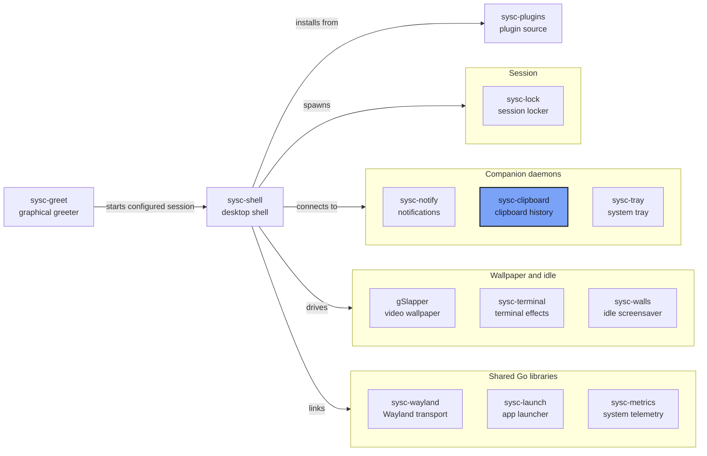

<p align="center"></p>

<p align="center"><strong>Clipboard history for Wayland, encrypted at rest.</strong></p>

<p align="center">Watches the clipboard, keeps the last 100 entries, and serves them to sysc-shell's clipboard panel over a private socket.</p>

## What it is

sysc-clipboard is the clipboard history daemon behind
[sysc-shell](https://github.com/Nomadcxx/sysc-shell). It watches selections through
`ext-data-control-v1` (falling back to `wlr-data-control`), stores text and images encrypted on
disk, and exposes metadata, previews and thumbnails to the shell. The socket carries metadata, text previews and thumbnails; full clipboard payloads stay in the
daemon.

## How it fits together



[The sysc ecosystem](https://github.com/Nomadcxx/sysc-shell/blob/main/docs/ecosystem.md) explains
each connection, socket and version pin.

## Features

- **100 entries, 256 MiB total**: text up to 4 MiB and images up to 32 MiB per entry
- **Restores with the original MIME type**
- **Pins**: pinned entries survive `ClearUnpinned` and sort first; `ClearAll` removes them
- **Encrypted at rest**: AES-256-GCM per entry plus an encrypted manifest, with the key in the
  Secret Service or a key file
- **Survives restarts**: history is loaded from disk on start
- **Private socket**: metadata, 200-byte text previews and PNG thumbnails only
- **`ext-data-control-v1`** with a `zwlr-data-control` fallback
- **Refuses password-manager selections** (`x-kde-passwordManagerHint`); the primary selection is
  not captured
- **Duplicate payloads** merge their MIME types and keep their pin
- **A corrupt manifest is quarantined** and history degrades to volatile instead of failing

## Install

### Requirements

Go 1.26+, a compositor with data-control, and a Secret Service provider (or `--key-file`).

### From source

```bash
git clone https://github.com/Nomadcxx/sysc-clipboard
cd sysc-clipboard
go build -o ~/.local/bin/sysc-clipboard ./cmd/sysc-clipboard
export PATH="$HOME/.local/bin:$PATH"
```

Or:

```bash
GOBIN="$HOME/.local/bin" go install github.com/Nomadcxx/sysc-clipboard/cmd/sysc-clipboard@latest
export PATH="$HOME/.local/bin:$PATH"
```

### As a user service

```bash
install -Dm644 contrib/sysc-clipboard.service ~/.config/systemd/user/sysc-clipboard.service
systemctl --user daemon-reload
systemctl --user enable --now sysc-clipboard.service
```

## Usage

sysc-clipboard has no interface of its own; sysc-shell draws the history. To inspect persistence and runtime configuration:

```bash
sysc-clipboard --check
```

It prints the state directory, socket, entry count and persistence mode (`durable`, `volatile` or
`unavailable`), then exits 0 or 1 without starting the daemon. This checks stored history and
configuration; it does not connect to a running daemon or check Wayland availability. Invalid
arguments exit 2.

| Flag | Meaning |
|---|---|
| `--check` | Print state and exit |
| `--key-file <path>` | Use a key file instead of the Secret Service |
| `--state-dir <path>` | Override the state directory (must be absolute) |

The state directory is `$XDG_STATE_HOME/sysc-clipboard`, falling back to
`~/.local/state/sysc-clipboard`.

## Clients

Run inside an existing Go module:

```bash
go get github.com/Nomadcxx/sysc-clipboard/client
```

The client package offers `Restore`, `Pin`, `Delete`, `Clear`, `Thumbnail` and `Resync`, plus an
`Updates()` stream of snapshots and deltas.

## Documentation

- [The sysc ecosystem](https://github.com/Nomadcxx/sysc-shell/blob/main/docs/ecosystem.md)
- [sysc-shell](https://github.com/Nomadcxx/sysc-shell) — the shell that draws the clipboard panel

## License

BSD-3-Clause.

---

<a href="https://github.com/Nomadcxx"></a> — terminal-native tooling for the linux desktop.
[More projects →](https://github.com/Nomadcxx) · [Sponsor](https://github.com/sponsors/Nomadcxx) ❤️
